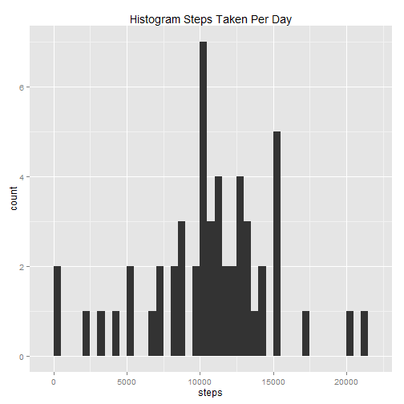
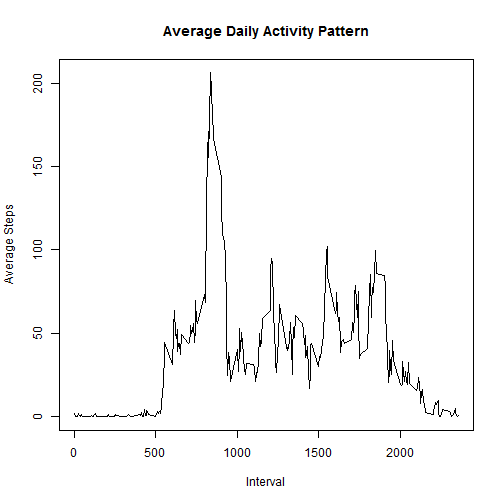
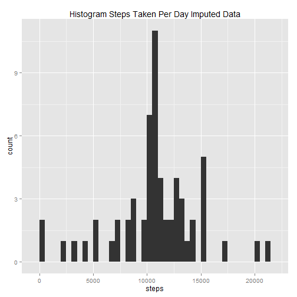
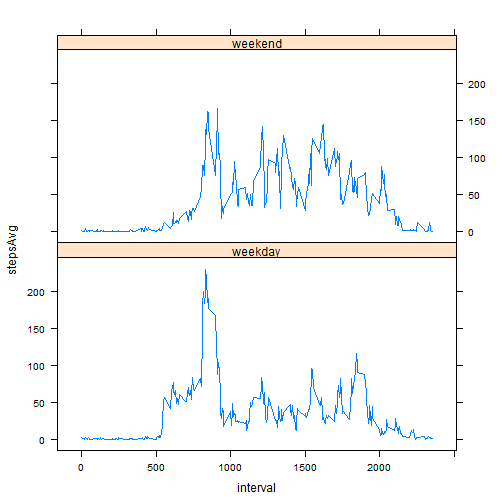

## Loading the data and required libraries


```r
library(ggplot2)
library(dplyr)
library(lattice)
activityData<-read.csv("activity/activity.csv")
```


## What is mean total number of steps taken per day?

Summing the total number of steps taken each day. Plotting histogram for total steps taken each day.


```r
activityDataKnown<-activityData[!is.na(activityData$steps),]
dataKnownDatesGrp<-group_by(activityDataKnown,date)
dataKnownDates<-summarize(dataKnownDatesGrp,steps=sum(steps))

qplot(steps,data=dataKnownDates,main="Histogram Steps Taken Per Day",binwidth=500)
```

 

```r
meanSteps<-mean(dataKnownDates$steps)
medianSteps<-median(dataKnownDates$steps)
```

Mean total number of steps taken per day = 1.0766189 &times; 10<sup>4</sup>  
Median total number of steps taken per day = 10765


## What is the average daily activity pattern?
Averaging number of steps taken across all days for each interval. Following is the time series plot.

```r
dataKnownIntervalGrp<-group_by(activityDataKnown,interval)
dataKnownIntervalAvg<-summarize(dataKnownIntervalGrp,stepsAvg=mean(steps))

plot(dataKnownIntervalAvg$interval,dataKnownIntervalAvg$stepsAvg,type='l',xlab='Interval',ylab='Average Steps',main='Average Daily Activity Pattern')
```

 

```r
maxAvgStepsInterval = dataKnownIntervalAvg$interval[which.max(dataKnownIntervalAvg$stepsAvg)]
```

Interval 835 contains the maximum number of steps averaged across all the days.

## Imputing missing values


```r
numMissingVals <- sum(is.na(activityData$steps))
```

Missing values in data are 2304.  

Filling average number of steps taken over all days for the interval in place of missing values.


```r
mergedActivityData<-merge(activityData,dataKnownIntervalAvg,by.x='interval',by.y='interval')
mergedActivityData$steps[is.na(mergedActivityData$steps)]=mergedActivityData$stepsAvg[is.na(mergedActivityData$steps)]
activityDataImputed<-select(mergedActivityData,steps,date,interval)
```

Summing the total number of steps taken each day. Plotting histogram for total steps taken each day.


```r
dataImputedDatesGrp<-group_by(activityDataImputed,date)
dataImputedDates<-summarize(dataImputedDatesGrp,steps=sum(steps))
qplot(steps,data=dataImputedDates,main="Histogram Steps Taken Per Day Imputed Data",binwidth=500)
```

 

```r
meanSteps<-mean(dataImputedDates$steps)
medianSteps<-median(dataImputedDates$steps)
```

Mean steps total number of steps taken per day = 1.0766189 &times; 10<sup>4</sup>  
median steps total number of steps taken per day = 1.0766189 &times; 10<sup>4</sup>  

Mean steps and median steps are same for imputed data. Mean steps are same for missing data and imputed data.

## Are there differences in activity patterns between weekdays and weekends?

Adding new column dayType. This column takes value weekday or weekend. Following is time series plot of the 5-minute interval (x-axis) and the average number of steps taken, averaged across all weekday days or weekend days (y-axis). There seems to be slight difference in activity patterns between weekdays and weekends.


```r
activityDataImputed<-transform(activityDataImputed,date=strptime(date,"%Y-%m-%d"))
activityDataImputed<-transform(activityDataImputed,dayType=ifelse(weekdays(date) %in% c("Saturday","Sunday"),"weekend","weekday"))

dataWeekday<-filter(select(activityDataImputed,steps,interval,dayType),dayType=="weekday")
dataWeekend<-filter(select(activityDataImputed,steps,interval,dayType),dayType=="weekend")

weekdayIntervalGrp<-group_by(dataWeekday,interval)
weekdayInterval<-summarize(weekdayIntervalGrp,stepsAvg=mean(steps))
weekdayInterval$dayType<-"weekday"

weekendIntervalGrp<-group_by(dataWeekend,interval)
weekendInterval<-summarize(weekendIntervalGrp,stepsAvg=mean(steps))
weekendInterval$dayType<-"weekend"

intervalMean<-rbind(weekdayInterval,weekendInterval)

xyplot(stepsAvg ~ interval | dayType, data= intervalMean, layout=c(1,2),type="l",color="blue")
```

 


